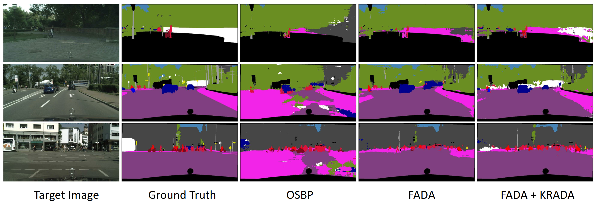

# KRADA: Known-region-aware Domain Alignment for Open-set Domain Adaptation in Semantic Segmentation
This repository provides pytorch implementation of [Known-region-aware Domain Alignment (KRADA) method](https://openreview.net/forum?id=5II12ypVQo) [TMLR].

## Problem Setup: Open-set domain adaptation segmentation (OSDAS)
Suppose that a set of source images with annotations are denoted as $$\lbrace X^S, Y^S \rbrace$$ where the source label space is $\mathbb{L}^{H\times W}$ and $$\mathbb{L}=\lbrace 1, \dots, K \rbrace$$ is the category label set with $K$ known classes. The target images $$X^T$$ are drawn from a different distribution and the target label set has an additional label $K+1$ to denote the unseen classes that do not appear in $$\mathbb{L}$$. We aim to train a segmentation model $\mathcal{M}$ to accurately classify each pixel in target images $X^T$ into one class of the label set $$\lbrace 1,\dots, K, K+1 \rbrace$$.

This code archive includes the Python implementation of "On Characterizing the Trade-off in Invariant Representation
Learning" and corresponding baseline methods. We model the encoder via `r` functions in a universal reproducing kernel
Hilbert spaces, where `r` is the embedding dimensionality. Denoted by K-T-Opt, our method aims to maximize the
dependency between the representation `Z` and the target attribute `Y` while keeping the dependency between `Z` and the
semantic attribute S as small as possible. Suppose the statistical dependence between `Y` and `S` is not negligible.
In that case, there will be a trade-off between the utility of the downstream target task and invariance to `S`,
as shown in the following diagram.

## Requirements:

- python = 3.6.12
- torch = 1.7.1
- torchvision = 0.8.2

1.7.1+cu110
0.8.2+cu110

## Citation

If you think this work is useful to your research, please cite:

## References:

[1] AdaptSegNet (Tsai et al., 2018): https://github.com/wasidennis/AdaptSegNet

[2] CLAN (Luo et al., 2019): https://github.com/RoyalVane/CLAN

[3] FADA (Wang et al., 2020): https://github.com/JDAI-CV/FADA

