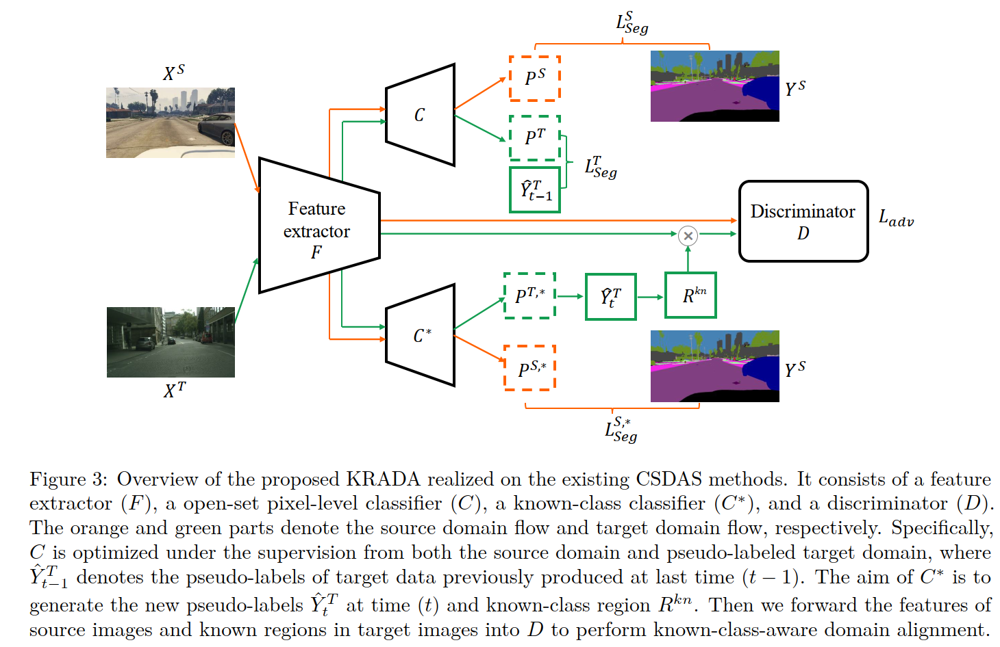
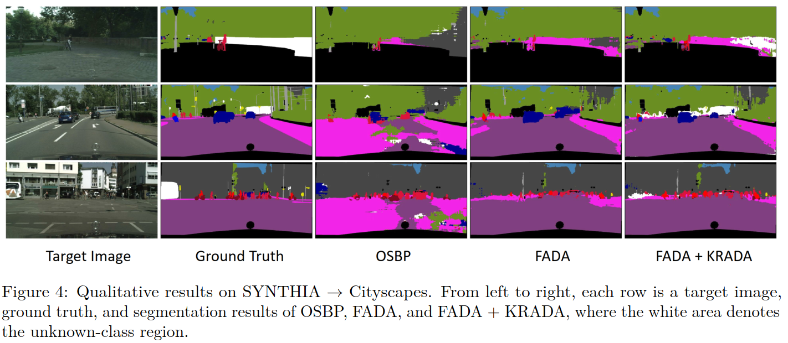

# KRADA: Known-region-aware Domain Alignment for Open-set Domain Adaptation in Semantic Segmentation
This repository provides pytorch implementation of [Known-region-aware Domain Alignment (KRADA) method](https://openreview.net/forum?id=5II12ypVQo) [TMLR].

## Problem Setup: Open-set domain adaptation segmentation (OSDAS)

Suppose that a set of source images with annotations are denoted as $\lbrace X^S, Y^S \rbrace$ where the source label space is $\mathbb{L}^{H\times W}$ and $\mathbb{L}=\lbrace 1, \dots, K \rbrace$ is the category label set with $K$ known classes. The target images $X^T$ are drawn from a different distribution and the target label set has an additional label $K+1$ to denote the unseen classes that do not appear in $\mathbb{L}$. We aim to train a segmentation model $\mathcal{M}$ to accurately classify each pixel in target images $X^T$ into one class of the label set $\lbrace 1,\dots, K, K+1 \rbrace$.

## Known-region-aware Domain Alignment (KRADA)

## Visualization Results

## Prerequisites:

- python = 3.6.12
- torch = 1.7.1
- torchvision = 0.8.2

## Reproduce:
- Download the SYNTHIA Dataset.   
- Download the Cityscapes Dataset.     

Here we provide the code for reproducing the implementations of AdaptSegNet + KRADA, CLAN + KRADA, and FADA + KRADA for the Synthia -> Cityscapes task. You can find the ` .sh ` file in each folder to train and evaluate the models. More code details can be found in the original [AdaptSegNet](https://github.com/wasidennis/AdaptSegNet), [CLAN](https://github.com/RoyalVane/CLAN), [FADA](https://github.com/JDAI-CV/FADA).

## Citation

If you think this work is useful to your research, please cite:
  To be done.

## References:

[1] AdaptSegNet (Tsai et al., 2018): https://github.com/wasidennis/AdaptSegNet

[2] CLAN (Luo et al., 2019): https://github.com/RoyalVane/CLAN

[3] FADA (Wang et al., 2020): https://github.com/JDAI-CV/FADA

[4] OSBP (Saito et al., 2018b) https://github.com/ksaito-ut/OPDA_BP

